# Square Up — App Flow (Mermaid)

This document describes how the Square Up app works and the complete user/system flow using Mermaid flowcharts.

---

## 1. App entry and onboarding

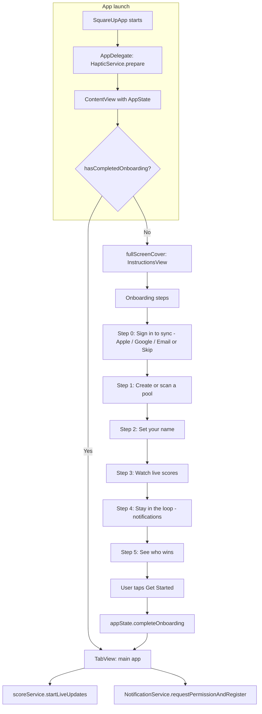

---

## 2. Main app structure (tabs)

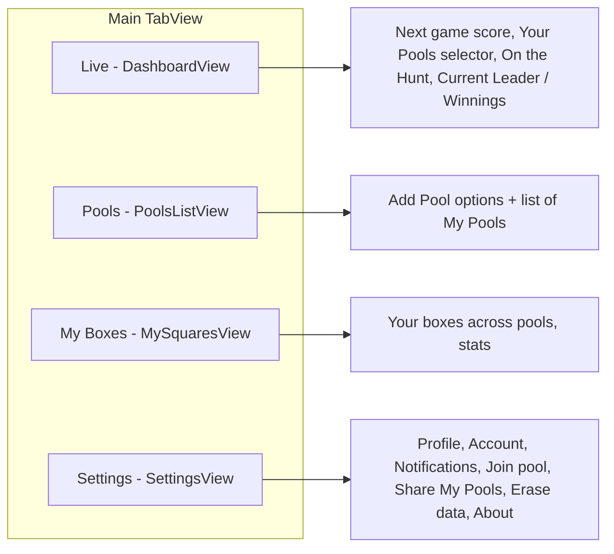

---

## 3. Adding a pool (high-level)

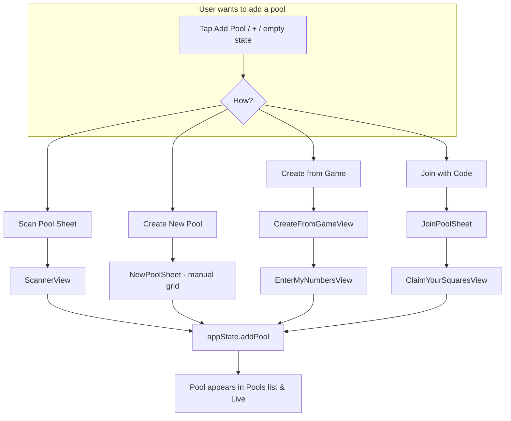

---

## 4. Scan pool sheet flow (detail)

```mermaid
flowchart TD
    subgraph Scan["ScannerView"]
        S0[Select game for scan - sport, pick game or Skip]
        S0 --> S1[Idle: Camera | Photo library | Manual entry]
        S1 --> |Camera| S2[CameraView - capture]
        S1 --> |Photo| S3[PhotosPicker - pick image]
        S1 --> |Manual| S4[ManualEntryView]
        S2 --> S5[handleCapturedImage]
        S3 --> S5
        S5 --> S6[Enter name as on sheet + optional pool name]
        S6 --> S7[Start OCR]
        S7 --> S8[Processing - VisionService or AIGrid backend]
        S8 --> S9{Success?}
        S9 -->|Yes| S10[ReviewScanView]
        S9 -->|No| S11[Error - Retry or Manual entry]
        S11 --> S1
        S11 --> S4
        S10 --> S12[Edit pool name, teams, numbers, grid]
        S12 --> S13[Payout rules: type / Speak / Photo]
        S13 --> S14[Optional: Parse with AI - PayoutParseService]
        S14 --> S15[Confirm & Save or Retry Scan]
        S15 --> S16[onPoolScanned - add pool, dismiss]
    end
```

---

## 5. Join pool with code flow

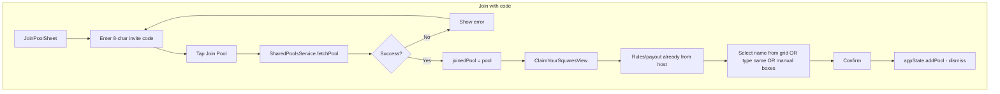

---

## 6. Create from game flow

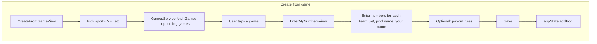

---

## 7. After a pool exists — Live & scores

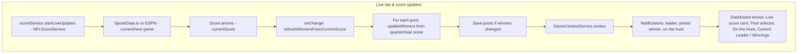

---

## 8. Grid detail (viewing/editing a pool)

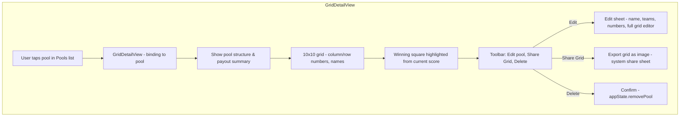

*Invite codes are generated from **Settings → Share My Pools** (see section 9a).*

---

## 9. Settings and account

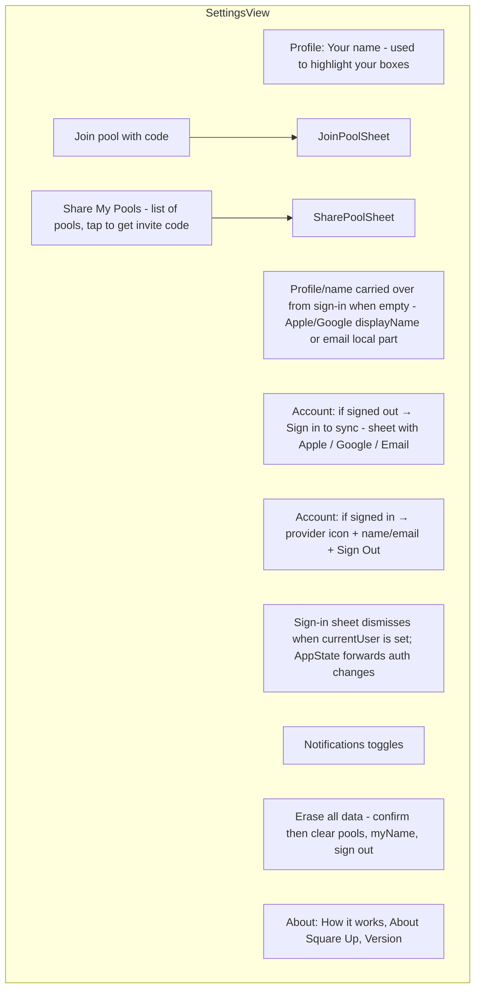

---

## 9a. Share pool (invite code) flow

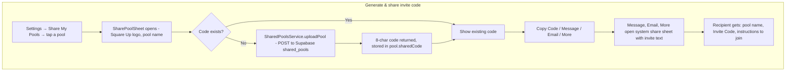

---

## 10. Data and backend dependencies

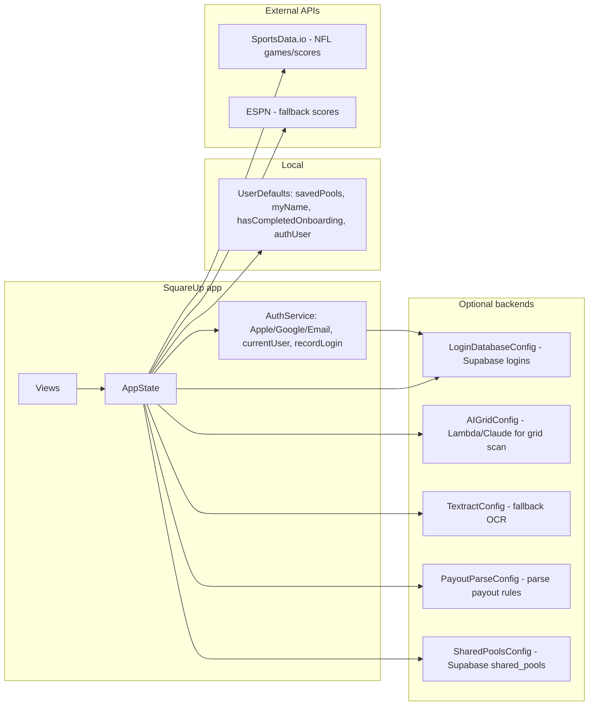

---

## 11. End-to-end flow summary

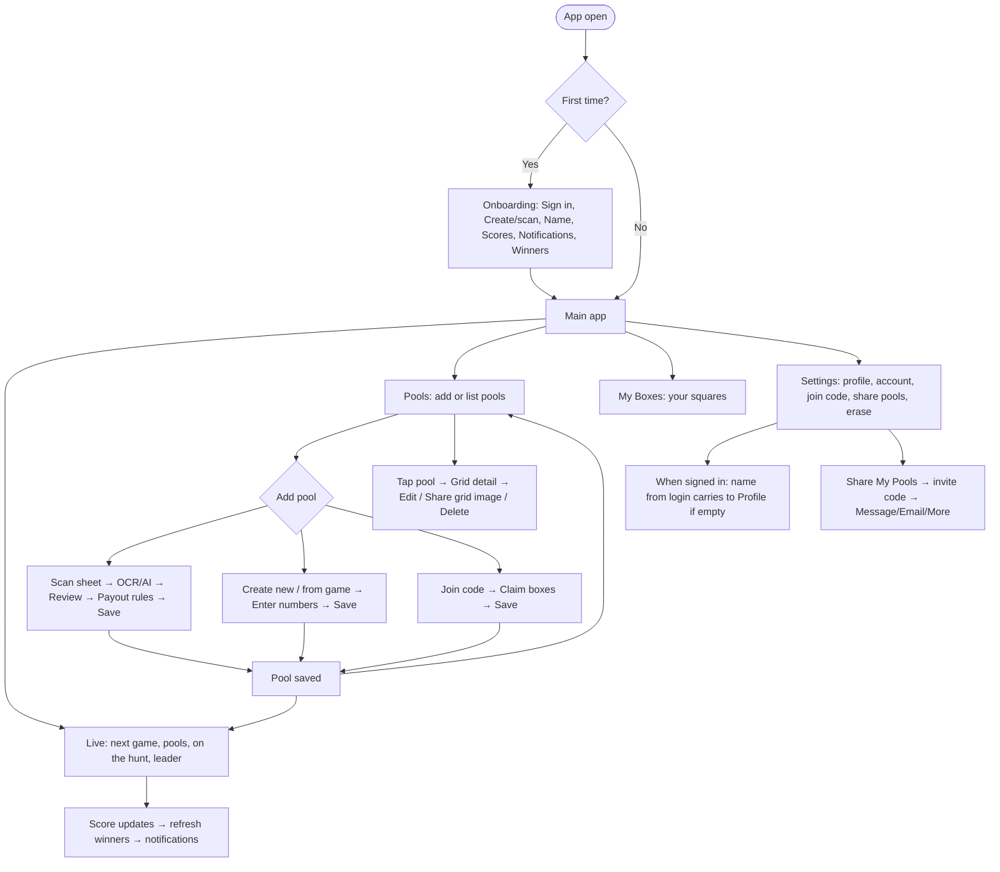

---

*Square Up — pool sheets, live scores, and payouts.*
