# Square Up — Full pack for Mario (Counsel)

**Prepared for:** Mario (Counsel)  
**Contents:** Legal brief (P2P model, flowcharts), database schemas, app flow (Mermaid).  
**Date:** February 2025  
**Status:** Discussion draft — not legal advice

View this file on **GitHub** to see all Mermaid flowcharts rendered. In the repo: **docs/MARIO_FULL_PACK.md**.

---

# Part 1 — Legal brief: P2P gaming model

## One-page summary

**What we built:** A mobile app (**Square Up**) where users **create** or **join** existing pool games (e.g. Super Bowl squares, box pools, brackets). All code is custom; we do not use third-party betting or gambling SDKs.

**How it works:** One user creates a pool and sets the rules (e.g. “$25 per quarter, halftime double”). Others join via invite code. Money flows **between participants** according to those rules when the game resolves (e.g. score at end of Q2). The **app does not take a cut**, set odds, or act as a counterparty.

**Why it may matter legally:** We are exploring whether this **peer-to-peer, no-house, no-bookmaker** model differs meaningfully from (a) regulated prediction markets (Kalshi, Polymarket) and (b) traditional sportsbooks, for purposes of gambling licensing and regulation.

**Ask for counsel:** Whether this structure raises different (or lower) regulatory risk in the U.S. (federal and state), and what guardrails or disclosures you would recommend before scaling.

---

## 1. The idea

Square Up is a **peer-to-peer (P2P) gaming** platform:

- **Users create games** — e.g. a 10×10 “squares” pool for the Super Bowl, with custom payout rules (by quarter, halftime, final, first score, etc.).
- **Users join games** — via invite codes; no discovery of “odds” or “markets” run by the platform.
- **Resolution and payouts** — based on real-world outcomes (e.g. NFL score at end of each quarter). The **creator** of the pool defines the rules; the app facilitates tracking and (optionally) sharing the pool, but **does not set odds, take vig, or act as the house**.

Contrast with:

- **Kalshi / Polymarket** — prediction **markets**. The platform typically operates or hosts markets, often with a central counterparty or liquidity pool; regulatory treatment (CFTC, state) is a live issue.
- **Traditional sportsbooks** — the **bookmaker** sets odds and takes a margin; clearly regulated as gambling in most jurisdictions.

Our hypothesis: **“Gaming your way”** — creating and joining **user-defined pools with no house and no oddsmaker** — may sit in a different category for licensing and compliance. We want your view on that.

---

## 2. How the model works (flowcharts)

### 2.1 Traditional sportsbook vs. Square Up (P2P)

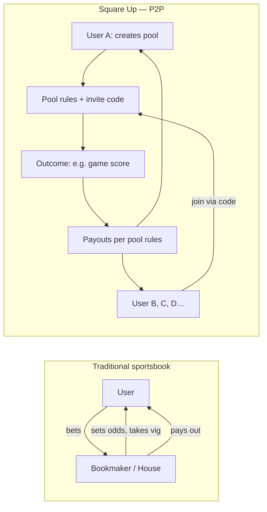

**Takeaway:** In our model, the **platform does not take a position or a cut**. It is a tool for creating, joining, and resolving **user-created pools** where money moves **between participants** according to **user-defined rules**.

### 2.2 User flow: Create vs. join

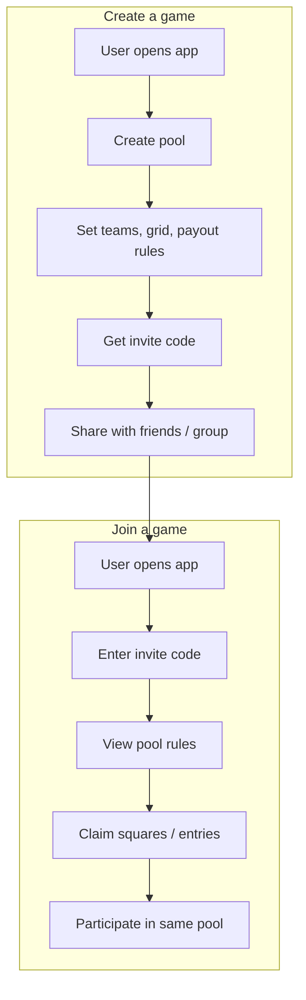

**Takeaway:** Every pool is **created by a user** and **joined by others**. The app does not list “markets” or “odds”; it only enables creation, joining (via code), and tracking of these private pools.

### 2.3 Where money and control sit

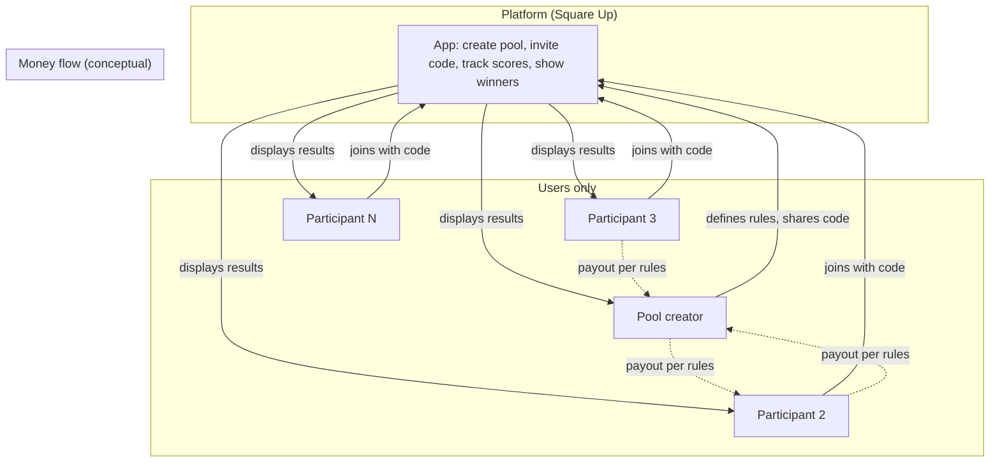

**Takeaway:** The **platform does not hold or move funds**. It provides the structure (grid, rules, invite, resolution). Any money flow is **between users**, off-platform (e.g. Venmo, cash) or via whatever mechanism the group agrees on.

---

## 3. Context: Prediction markets and regulation

- **Kalshi** — CFTC-regulated prediction market (event contracts); often in the news for scope of allowed markets.
- **Polymarket** — prediction markets; regulatory status has been debated (e.g. CFTC, state gambling).
- **Trend** — “Prediction betting” and micro-markets are popular; regulation is evolving.

Our product is **not** a prediction market in that sense:

- We do not list or operate **markets** or **event contracts**.
- We do not act as counterparty or liquidity provider.
- We enable **user-created, invite-only pools** with user-defined rules and no house edge.

We want to understand from counsel whether this **P2P, no-house, no-oddsmaker** framing is relevant for:

- Federal (e.g. Wire Act, UIGEA, CFTC) and state gambling laws.
- Distinctions between “gambling” (house, bookmaker) and “social / skill-based / P2P” gaming in your view.
- Any specific risks or mitigations (disclaimers, terms of use, geography, no real-money in-app, etc.).

---

## 4. Technical and product guardrails (current)

- **Custom code only** — no integration with third-party betting or gambling APIs/SDKs.
- **No house odds** — the app does not set or display odds; it only reflects user-defined pool rules.
- **Invite-based access** — pools are joined by code, not by browsing a marketplace of “bets.”
- **Resolution** — based on publicly available outcomes (e.g. official game scores) and user-set rules.
- **Money** — the app does not process payments or hold user funds; payouts are between participants.

---

## 5. Questions for Mario (counsel)

1. Does the **P2P, no-house, no-bookmaker** structure meaningfully affect how this might be viewed under federal and state gambling laws compared to (a) prediction markets and (b) traditional sportsbooks?
2. Are there states or jurisdictions where this type of “user-created pool” tool is explicitly addressed (permitted, restricted, or prohibited)?
3. What **risk-mitigation** steps would you recommend (e.g. terms of use, disclaimers, age/geography restrictions, no in-app real-money transfer)?
4. Given the current popularity of prediction-style products (Kalshi, Polymarket), is there a window to position a **strictly P2P, no-house** product differently in regulatory discussions or with partners?
5. Any other legal or compliance considerations we should build into the plan before scaling (e.g. advertising, referrals, or future features)?

---

## 6. Next steps

- Share this brief and flowcharts with Mario.
- Schedule a call to walk through the model and his initial impressions.
- Based on his feedback, update product and terms (and this doc) and decide on any formal opinion or deeper state-by-state review.

---

## 7. How we differ from Kalshi and Polymarket

| Dimension | Kalshi | Polymarket | Square Up |
|-----------|--------|------------|-----------|
| **What it is** | CFTC-regulated prediction **exchange**. Platform lists and operates event contracts (e.g. “Will X happen?”). Users trade yes/no shares; prices move with demand. | Decentralized-style **prediction markets**. Platform hosts markets; users buy/sell outcome shares. Often crypto-backed; regulatory status debated (CFTC, state gambling). | **P2P pool tool.** We do not list or operate any markets. Users create private pools and invite others by code. No trading, no shares, no platform-run odds. |
| **Who sets “the game”** | The platform (and regulators). Markets are created and approved by Kalshi/CFTC. | The platform or market creators. Polymarket hosts and displays markets. | **The user.** One person creates the pool and sets the rules (e.g. $25 per quarter, halftime double). |
| **Discovery** | Open marketplace. Anyone can browse and trade on listed events. | Open marketplace. Users browse and trade on listed markets. | **Invite-only.** No browse, no discovery. You join only via a code shared by the pool creator. |
| **Counterparty / house** | Exchange model; platform facilitates matching and may take fees. Regulated as exchange. | Platform or liquidity providers; users trade against the market. | **None.** No house, no platform position, no vig. Money flows only between participants per pool rules. |
| **Money flow** | Users deposit; trade; withdraw. Platform may hold funds in regulated capacity. | Users fund (often crypto); trade; withdraw. | **We do not hold or move funds.** Payouts are between participants (e.g. Venmo, cash), off the app. |
| **Regulatory posture** | Explicitly CFTC-regulated; event contracts framework. | Under regulatory scrutiny; CFTC and state gambling discussions. | **Different by design.** We aim to be a tool for user-created, private, P2P pools—not a prediction market or bookmaker. |

**Summary:** Kalshi and Polymarket are **platform-operated prediction markets** with open discovery and trading. Square Up is a **creator-led, invite-only, P2P pool product** with no platform markets, no house, and no in-app money movement. The doc asks counsel whether that distinction matters for federal and state regulation.

---

## 8. BVP (business value proposition) and how we succeed

### Value proposition

- **“Gaming your way.”** Users run the game: they set the rules, invite who they want, and resolve on real-world outcomes. The app is a **tool** (create pool, share code, track scores, show winners), not a venue that operates markets or takes a cut.
- **Social and private.** Pools are for your group (office, friends, family). No public odds, no platform-run markets—so the experience is closer to a private Super Bowl squares sheet than to a betting app.
- **One product, many game types.** Same P2P pattern works for squares, brackets, survivor, pick’em, and custom rules (see Section 9). Creator sets the game; others join by code; resolution and payouts stay between participants.

### How we succeed

1. **Regulatory distinction.** If counsel confirms that P2P, no-house, invite-only pools sit in a different bucket than prediction markets and sportsbooks, we can position and scale with that clarity (terms, disclaimers, geography, no in-app real-money transfer as needed).
2. **Distribution through creators.** Every pool has a creator who invites others. Growth comes from creators sharing codes (messaging, social, email). We don’t need to run ads for “markets” or odds—we need a great tool that creators want to use and share.
3. **Trust and simplicity.** No trading, no order book, no crypto required. Create a pool, set rules, share a code, resolve on scores (or other outcomes). Easy to explain and to use for non-technical groups.
4. **Expandable game set.** Starting with squares/box pools; the same architecture supports brackets, survivor, pick’em, and custom rules. One platform, many game types—all P2P, all creator-defined.

---

## 9. Other game types and how the platform can work

The same **P2P pattern** applies across game types: a **creator** defines the game and rules, **invites** others via code, and **resolution** is based on real-world outcomes. The app does not set odds or act as house for any of these.

| Game type | How it works on Square Up | Creator sets | Resolution |
|-----------|---------------------------|--------------|------------|
| **Squares / box pools** (current) | 10×10 grid; each square = (row digit, column digit). Creator sets teams, payout rules (by quarter, halftime, final, first score, per score change, etc.). | Grid, teams, payout structure (we support fixed amounts, equal split, custom). | Last digit of each team’s score at defined times (e.g. end Q1, Q2, Q3, Q4 or final). |
| **Brackets** | Single-elimination bracket (e.g. March Madness). Creator sets entry fee and payout split (winner, runner-up, etc.). | Bracket size, teams/matchups, payout rules. | Real game results; bracket is scored by correct picks. |
| **Survivor / last man standing** | Each participant picks one team to win each week; if they lose, they’re out. Last remaining wins (or split). | Entry amount, payout (winner-take-all or top N), tie rules. | Real game results; app tracks who is still alive. |
| **Pick’em** | Pick winners (or against the spread) each week. Points for correct picks; highest total wins. | Point system, payout structure (e.g. weekly + season). | Real game results; app scores picks. |
| **Custom / other** | Creator describes rules (e.g. “first touchdown scorer,” “total points over/under for our group”). | Free-form rules; we can support structured templates or custom logic over time. | Agreed outcome (scores, events); payouts per creator-defined rules. |

**Unifying idea:** For every game type, the **platform provides structure and resolution only**—create, invite (code), track, and show winners. **Rules and payouts are set by the creator**; **money moves between participants**, not through us. That keeps the product clearly in the “P2P gaming tool” category rather than “prediction market” or “sportsbook.”

---

# Part 2 — Database schema

Canonical schema: **`supabase/migrations/20250204120000_create_logins_and_shared_pools.sql`**.

## 2.1 Table: `public.logins`

Stores sign-in events (Apple, Google, or Email) when **LoginDatabaseURL** and **LoginDatabaseApiKey** are set.

| Column             | Type         | Notes                    |
|--------------------|--------------|--------------------------|
| `id`               | `uuid`       | PK, default `gen_random_uuid()` |
| `provider`         | `text`       | NOT NULL — `"apple"`, `"google"`, or `"email"` |
| `provider_uid`     | `text`       | NOT NULL — opaque ID from provider |
| `email`            | `text`       | nullable                 |
| `display_name`     | `text`       | nullable                 |
| `client_timestamp` | `timestamptz`| nullable                 |
| `created_at`       | `timestamptz`| NOT NULL, default `now()` |

**RLS:** anon can `INSERT` only. App sends `Apikey` and `Authorization: Bearer <key>` when **LoginDatabaseApiKey** is set. App POSTs to `{LoginDatabaseURL}/logins` on sign-in and optionally to `/logins/signout` on sign-out.

## 2.2 Table: `public.shared_pools`

Stores invite codes for sharing pools. Used when **SharedPoolsURL** or **LoginDatabaseURL** (fallback) is set.

| Column      | Type         | Notes                    |
|-------------|--------------|--------------------------|
| `id`        | `uuid`       | PK, default `gen_random_uuid()` |
| `code`      | `text`       | NOT NULL — 8-char invite code, unique |
| `pool_json` | `jsonb`      | NOT NULL — full pool (BoxGrid) JSON |
| `created_at`| `timestamptz`| NOT NULL, default `now()` |

**Index:** `idx_shared_pools_code` UNIQUE on `(code)`.

**RLS:** anon can `INSERT` (upload pool → get code) and `SELECT` (fetch pool by code when joining).

**App usage:**
- **Upload (generate code):** `POST /rest/v1/shared_pools` with body `{ "code": "...", "pool_json": { ... } }`.
- **Fetch (join):** `GET /rest/v1/shared_pools?code=eq.XXXXXXXX&select=pool_json`.

---

# Part 3 — App flow (Mermaid)

## 3.1 App entry and onboarding

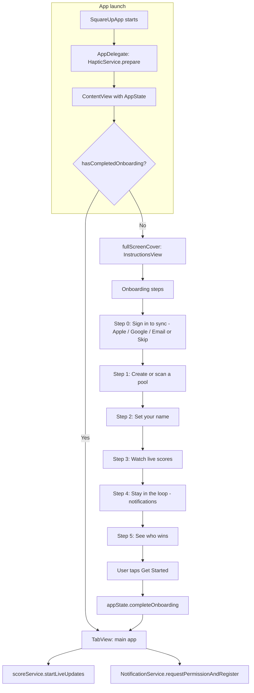

## 3.2 Main app structure (tabs)

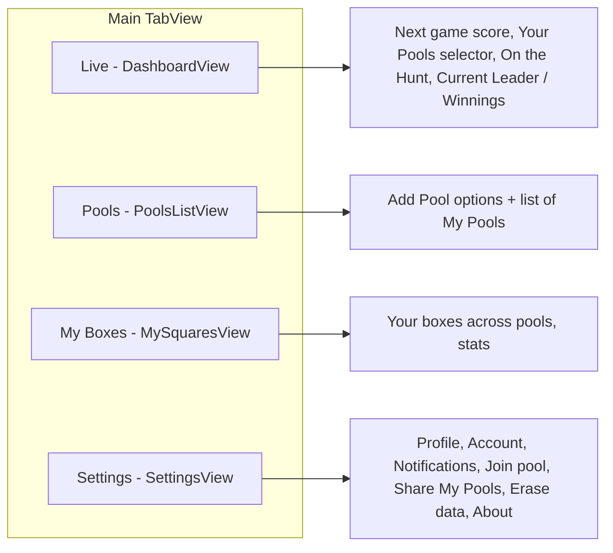

## 3.3 Adding a pool (high-level)

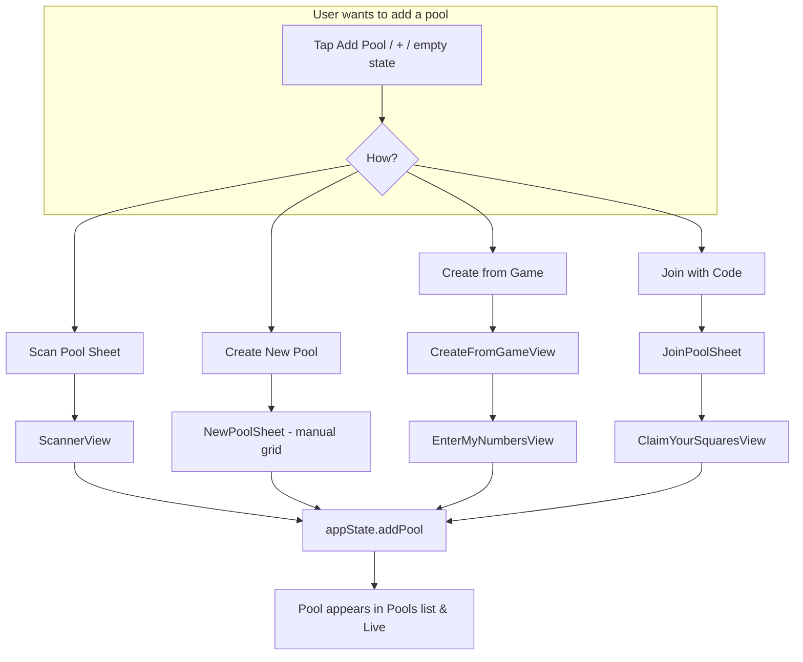

## 3.4 Join pool with code flow

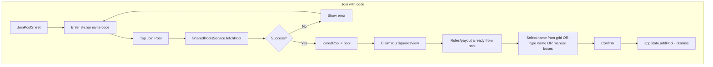

## 3.5 Share pool (invite code) flow

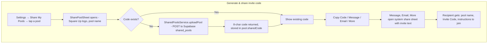

## 3.6 Settings and account

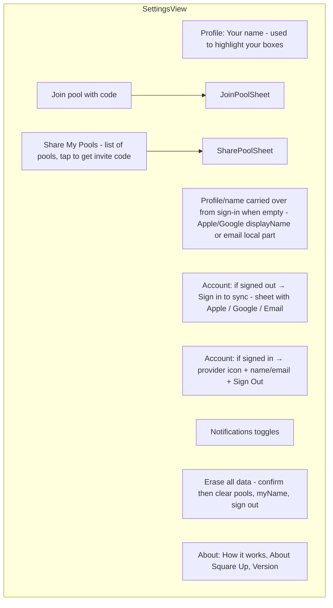

## 3.7 Data and backend dependencies

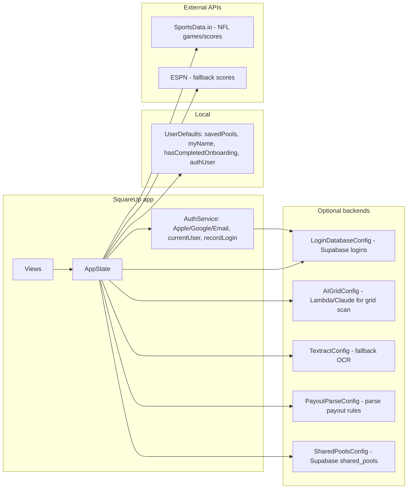

## 3.8 End-to-end flow summary

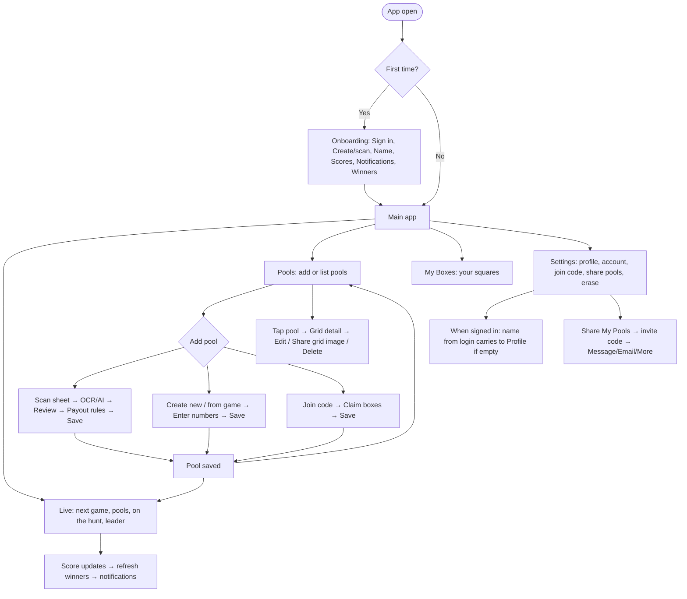

---

*This document is for discussion with counsel only and does not constitute legal advice. All product and legal decisions should be made in consultation with qualified counsel.*

*Square Up — pool sheets, live scores, and payouts.*
