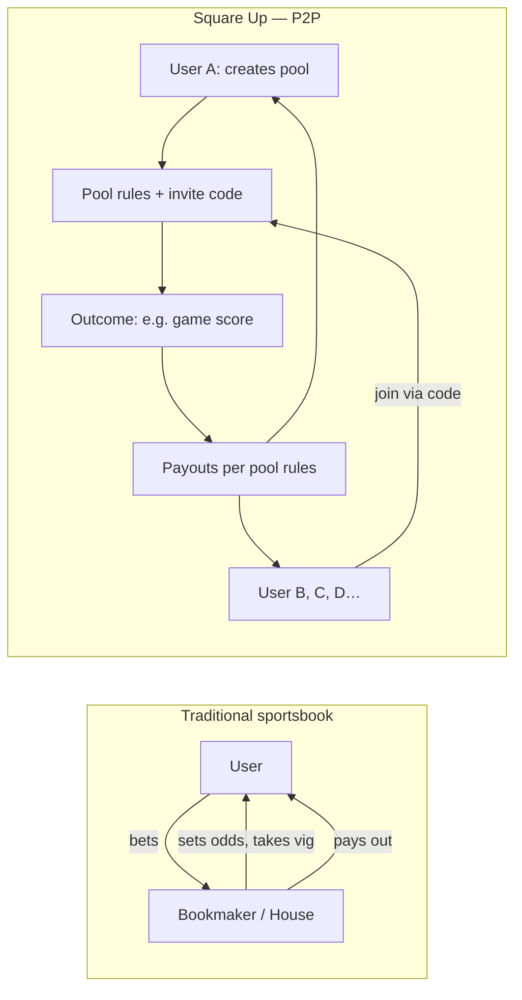
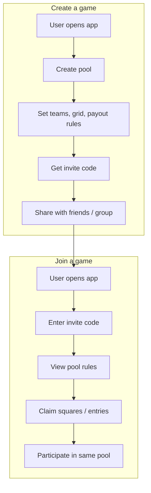
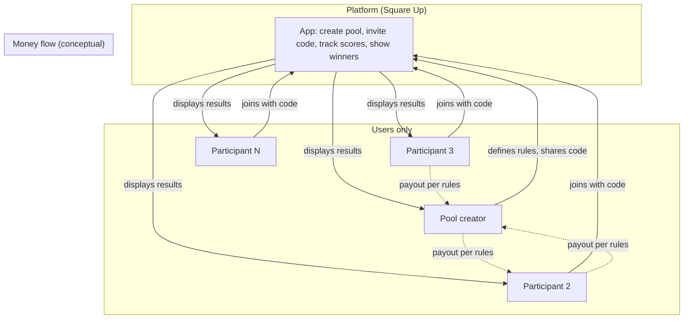

# Square Up — P2P Gaming Model: Legal Overview for Counsel

**Prepared for:** Mario (Counsel)  
**Subject:** Peer-to-peer pool gaming app; positioning vs. prediction markets (Kalshi, Polymarket) and licensed gambling  
**Date:** February 2025  
**Status:** Discussion draft — not legal advice

---

## One-page summary

**What we built:** A mobile app (**Square Up**) where users **create** or **join** existing pool games (e.g. Super Bowl squares, box pools, brackets). All code is custom; we do not use third-party betting or gambling SDKs.

**How it works:** One user creates a pool and sets the rules (e.g. “$25 per quarter, halftime double”). Others join via invite code. Money flows **between participants** according to those rules when the game resolves (e.g. score at end of Q2). The **app does not take a cut**, set odds, or act as a counterparty.

**Why it may matter legally:** We are exploring whether this **peer-to-peer, no-house, no-bookmaker** model differs meaningfully from (a) regulated prediction markets (Kalshi, Polymarket) and (b) traditional sportsbooks, for purposes of gambling licensing and regulation.

**Ask for counsel:** Whether this structure raises different (or lower) regulatory risk in the U.S. (federal and state), and what guardrails or disclosures you would recommend before scaling.

---

## 1. The idea

Square Up is a **peer-to-peer (P2P) gaming** platform:

- **Users create games** — e.g. a 10×10 “squares” pool for the Super Bowl, with custom payout rules (by quarter, halftime, final, first score, etc.).
- **Users join games** — via invite codes; no discovery of “odds” or “markets” run by the platform.
- **Resolution and payouts** — based on real-world outcomes (e.g. NFL score at end of each quarter). The **creator** of the pool defines the rules; the app facilitates tracking and (optionally) sharing the pool, but **does not set odds, take vig, or act as the house**.

Contrast with:

- **Kalshi / Polymarket** — prediction **markets**. The platform typically operates or hosts markets, often with a central counterparty or liquidity pool; regulatory treatment (CFTC, state) is a live issue.
- **Traditional sportsbooks** — the **bookmaker** sets odds and takes a margin; clearly regulated as gambling in most jurisdictions.

Our hypothesis: **“Gaming your way”** — creating and joining **user-defined pools with no house and no oddsmaker** — may sit in a different category for licensing and compliance. We want your view on that.

---

## 2. How the model works (flowcharts)

### 2.1 Traditional sportsbook vs. Square Up (P2P)

**Takeaway:** In our model, the **platform does not take a position or a cut**. It is a tool for creating, joining, and resolving **user-created pools** where money moves **between participants** according to **user-defined rules**.

### 2.2 User flow: Create vs. join

**Takeaway:** Every pool is **created by a user** and **joined by others**. The app does not list “markets” or “odds”; it only enables creation, joining (via code), and tracking of these private pools.

### 2.3 Where money and control sit

**Takeaway:** The **platform does not hold or move funds**. It provides the structure (grid, rules, invite, resolution). Any money flow is **between users**, off-platform (e.g. Venmo, cash) or via whatever mechanism the group agrees on.

---

## 3. Context: Prediction markets and regulation

- **Kalshi** — CFTC-regulated prediction market (event contracts); often in the news for scope of allowed markets.
- **Polymarket** — prediction markets; regulatory status has been debated (e.g. CFTC, state gambling).
- **Trend** — “Prediction betting” and micro-markets are popular; regulation is evolving.

Our product is **not** a prediction market in that sense:

- We do not list or operate **markets** or **event contracts**.
- We do not act as counterparty or liquidity provider.
- We enable **user-created, invite-only pools** with user-defined rules and no house edge.

We want to understand from counsel whether this **P2P, no-house, no-oddsmaker** framing is relevant for:

- Federal (e.g. Wire Act, UIGEA, CFTC) and state gambling laws.
- Distinctions between “gambling” (house, bookmaker) and “social / skill-based / P2P” gaming in your view.
- Any specific risks or mitigations (disclaimers, terms of use, geography, no real-money in-app, etc.).

---

## 4. Technical and product guardrails (current)

- **Custom code only** — no integration with third-party betting or gambling APIs/SDKs.
- **No house odds** — the app does not set or display odds; it only reflects user-defined pool rules.
- **Invite-based access** — pools are joined by code, not by browsing a marketplace of “bets.”
- **Resolution** — based on publicly available outcomes (e.g. official game scores) and user-set rules.
- **Money** — the app does not process payments or hold user funds; payouts are between participants.

---

## 5. Questions for Mario (counsel)

1. Does the **P2P, no-house, no-bookmaker** structure meaningfully affect how this might be viewed under federal and state gambling laws compared to (a) prediction markets and (b) traditional sportsbooks?
2. Are there states or jurisdictions where this type of “user-created pool” tool is explicitly addressed (permitted, restricted, or prohibited)?
3. What **risk-mitigation** steps would you recommend (e.g. terms of use, disclaimers, age/geography restrictions, no in-app real-money transfer)?
4. Given the current popularity of prediction-style products (Kalshi, Polymarket), is there a window to position a **strictly P2P, no-house** product differently in regulatory discussions or with partners?
5. Any other legal or compliance considerations we should build into the plan before scaling (e.g. advertising, referrals, or future features)?

---

## 6. Next steps

- Share this brief and flowcharts with Mario.
- Schedule a call to walk through the model and his initial impressions.
- Based on his feedback, update product and terms (and this doc) and decide on any formal opinion or deeper state-by-state review.

---

*This document is for discussion with counsel only and does not constitute legal advice. All product and legal decisions should be made in consultation with qualified counsel.*
